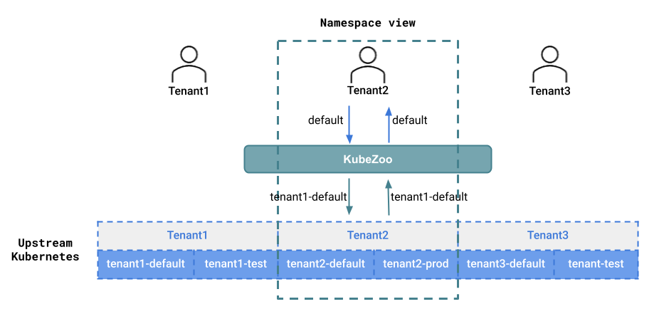
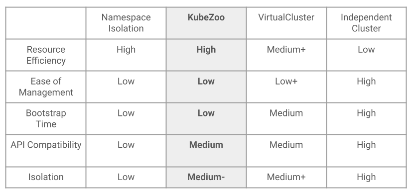

# kubezoo-io/kubezooio

[English](./README.md) | 简体中文

## 简介

KubeZoo 是轻量级的 Kubernetes 多租户项目，基于协议转换的核心理念在一个物理的 K8S 控制面上虚拟多个控制面，具备轻量级、兼容原生 API 、无侵入等特点。
详细设计请参考 [设计文档](./docs/design-cn.md)

  <!--[if IE]>
    
  <![endif]-->
  <picture>
    <source srcset="docs/img/kubezoo-overview-dark.png" width=80% title="KubeZoo Overview" media="(prefers-color-scheme: dark)">
    
  </picture>

## 为什么选择 KubeZoo

社区 Kubernetes Multi-Tenancy Working Group 定义 [3 种 Kubernetes 多租户模型](https://kubernetes.io/blog/2021/04/15/three-tenancy-models-for-kubernetes/)，例如： Namespace as a Service (NaaS)、Cluster as a Service (CaaS)、Control Planes as a service (CPaaS)，这些模型侧重于不同的场景。放眼公有云和部分私有云场景，通常会碰到如下问题：首先海量的小 K8S 集群更像是云上的常态；其次用户期望快速的交付一个 Kubernetes 环境；最后则是海量 Kubernetes 集群带来的巨大的运维管理成本。

增强 K8S 集群多租户功能，使其具备极低的资源和运维成本、秒级的生命周期管理、原生的 API 和安全能力，进而打造 Serverless K8S 底座，在 Serverless 大行其道的今天，其重要性不言而喻，亦是我们创造 KubeZoo 的初心。

  

您可以参考 [FAQ](./docs/faq.zh.md) 获得更多的信息。

## 前置依赖

请参考 [resource and system requirements](./docs/resource-and-system-requirements.md) 完成 KubeZoo 前置依赖检查。

## 部署

KubeZoo 支持 Kubernetes 1.24 及以下版本，更高的 Kubernetes 版本可能会导致兼容相关的问题。您可以采用如下方式部署 KubeZoo:

| Methods                     | Instruction                                | Estimated time |
| --------------------------- | ------------------------------------------ | -------------- |
| Deploy KubeZoo from scratch | [Deploy KubeZoo](./docs/manually-setup-cn.md) | < 2 minutes    |

## 社区

### 贡献

若您期望成为 KubeZoo 的贡献者，请参考 [CONTRIBUTING](CONTRIBUTING.md) 文档，我们也提供开发者手册 [guide](./docs/developer-guide.md) 供您参考。

### 联系方式

如果您有任何疑问，欢迎提交 GitHub issues 或者 pull requests，或者联系我们的 [Maintainers](./MAINTAINERS.md)。

## 协议

KubeZoo 采用 Apache 2.0 协议，协议详情请参考 [LICENSE](LICENSE)，另外 KubeZoo 中的某些实现依赖于 Kubernetes 代码，此部分版权归属于 Kubernetes Authors。