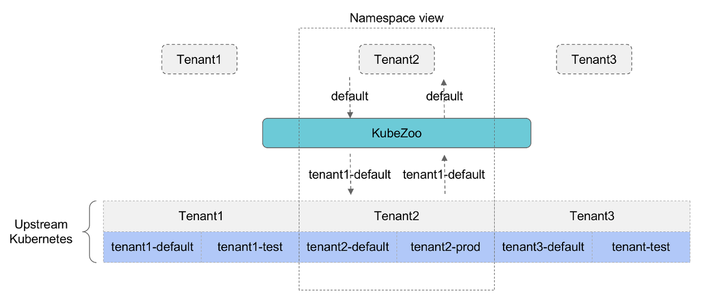
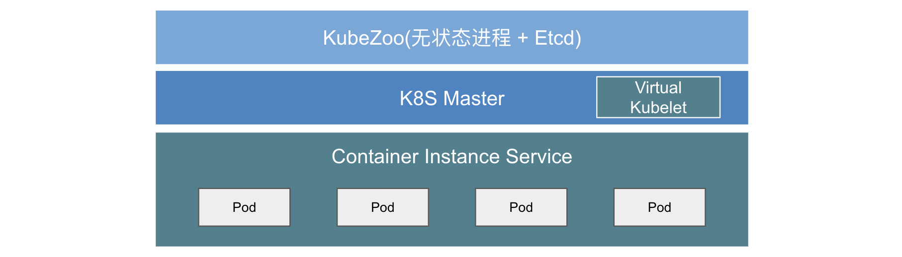
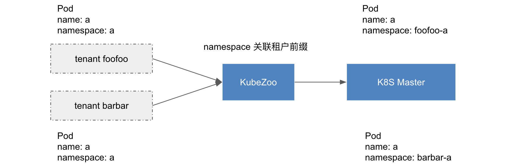
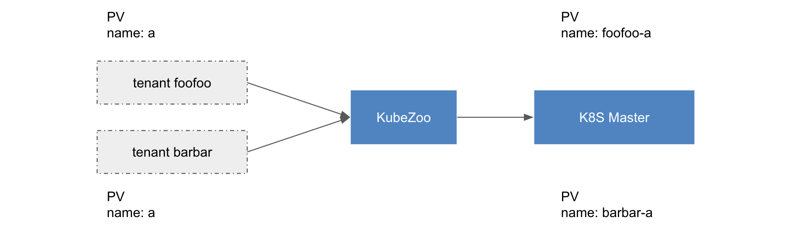
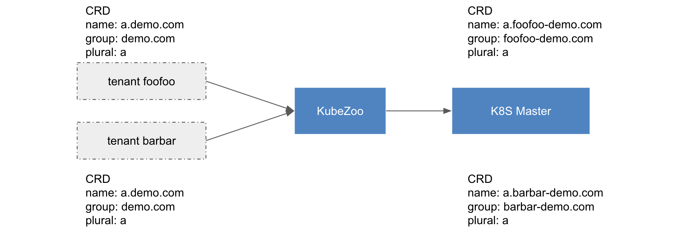

# 设计文档

## 理念简介

KubeZoo 基于`协议转换`核心理念实现控制面多租户功能，通过在资源的 name/namespace 等字段上增加租户的唯一标识
，解决不同租户的同名资源在同一个上游 Kubernetes 集群命名冲突的问题。



## 架构概览

如下图所示，KubeZoo 是一个独立部署的服务，它由一个无状态的 kubezoo-server 进程和 etcd 组成，具备良好的横向扩展能力。
它对租户提供统一的 Kubernetes 访问入口，并将来自租户的请求经过协议转换后转发至上游的 Kubernetes 集群，进而由上游的集群真正完成资源的表达。
上游 Kubernetes 的控制面主要为 Master 和 Etcd，数据面建议由弹性容器(如 AWS Fargate, Aliyun ECI 等)实现，从而具备更强网络、存储隔离能力，如 VPC 等等。



- KubeZoo：由无状态的 kubezoo-server 和 Etcd 组成。
- K8S Master：
    - Master：apiserver / scheduler / controller-manager / Etcd
    - Virtual Kubelet：衔接控制面和数据面，对接不同的公有云厂商弹性容器服务，最终完成 Master 中 Pod / Service 等资源的表达。
- Container Instance Service：公有云弹性容器服务，如 AWS Fargate, Aliyun ECI 等等。

## 租户管理

KubeZoo 内置 Tenant 对象，用于描述租户的基本信息，其中 name 是必须字段，全局唯一，长度固定 6 位字符串(包括字符或者数字)，
理论上可以管理 2176782336 个租户(36 ^ 6)，Tenant 对象存储于 KubeZoo 的 etcd 中，其格式如下：
````
apiVersion: tenant.kubezoo.io/v1alpha1
kind: Tenant
metadata:
name: "foofoo"
annotations:
  ...... # add schema for tenant(optional)
spec:
  id: 0
````

KubeZoo 提供证书签发的功能，管理员拥有 Tenant 生命周期管理的能力。每当管理员创建租户后，即为该租户签发一份 X509 证书，
证书中包含了租户的信息，如名字等等，并写入 annotations；同时将每个租户内置的 namespace，rbac 等同步到上游的 Kubernetes 中。

````
apiVersion: tenant.kubezoo.io/v1alpha1
kind: Tenant
metadata:
  name: "foofoo"
  annotations:
    kubezoo.io/tenant.kubeconfig.base64: YXBpVmVy...ExRbz0K
    ......
spec:
  id: 0
status: {}
````

每当管理员删除租户时，会触发租户资源回收，KubeZoo 删除上游 Kubernetes 该租户的所有资源，并清理 KubeZoo 侧的元信息。
由于租户的生命周期管理本质上是 Tenant 对象元信息的管理、证书签发和资源同步，其过程简洁，无需创建物理的 Master / Etcd 和计算资源池，
因而 KubeZoo 具备轻量级、秒级的海量租户生命周期管理能力。

## 协议转换

### Namespace Scope Resource

Kubernetes 大概有 40 多种 namespace scope 的资源，比如 deployment / statefulset / pod / configmap 等。
通过在每个资源的 namespace 字段关联租户信息，从而实现 namespace scope 资源的多租户能力。



### Cluster Scope Resource

Kubernetes 大概有 20 多种 cluster scope 的资源，比如 pv / namespace / storageclass 等等。通过在 name 关联租户信息，
从而实现 cluster scope 资源的多租户能力。




### Custom Resource

Custom Resource Definition(CRD) 是一种特殊的 cluster scope 资源，其 name 由 group + plural 组成，
我们选择在 group 前缀关联租户信息。


